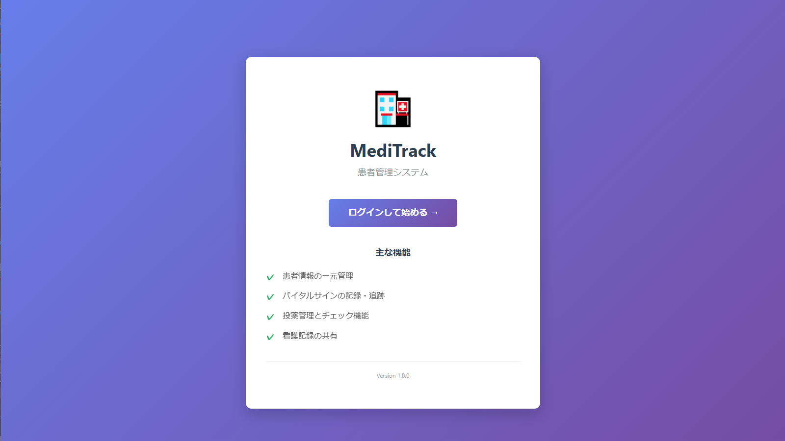
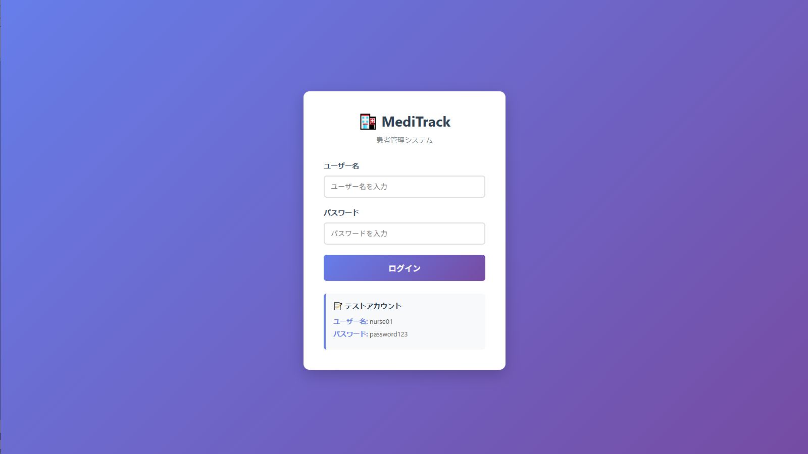
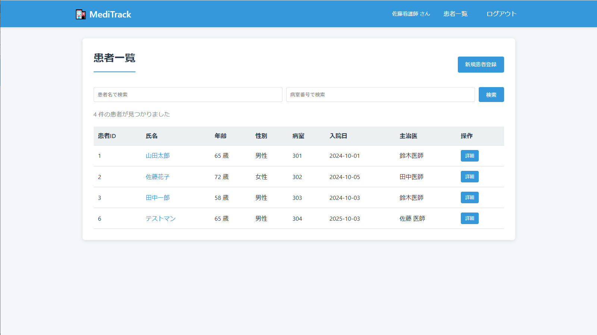
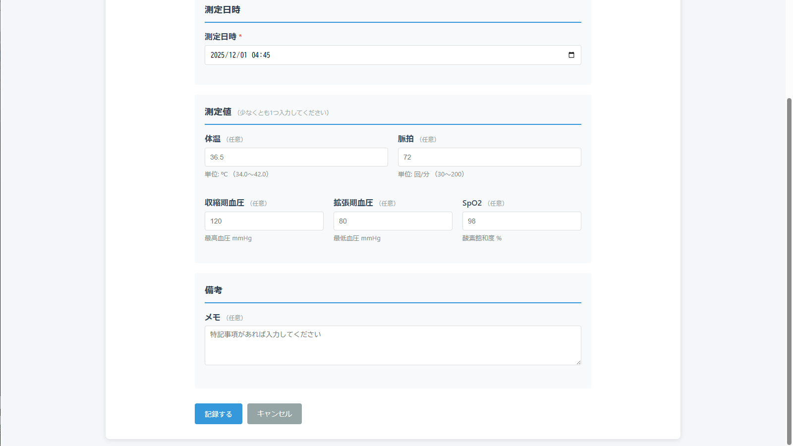
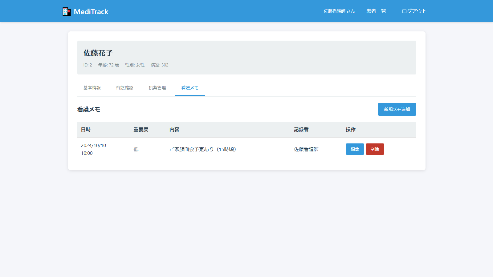
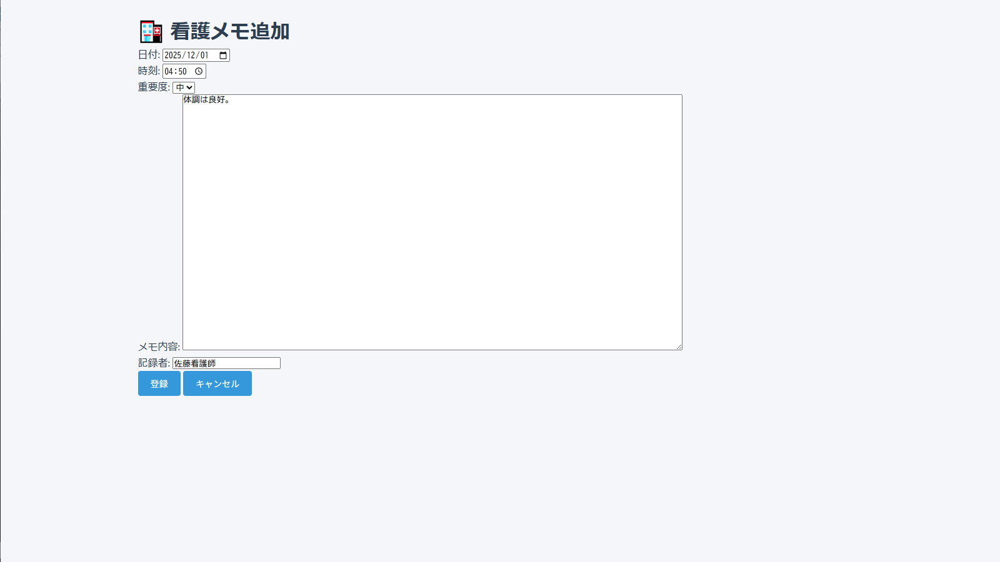

# MediTrack - 患者管理システム

医療現場向けの患者情報管理Webアプリケーションです。

## 概要

MediTrackは、病院や診療所での患者情報管理を効率化するために開発したWebアプリケーションです。
患者の基本情報、バイタルサイン、投薬記録、看護記録を一元管理できます。



## 主な機能

-       ユーザー認証: ログイン/ログアウト機能
-           患者管理: 患者情報の登録・編集・削除・一覧表示
- バイタルサイン記録: 体温、血圧、脈拍、SpO2などの記録・履歴管理
-           投薬管理: 投薬情報の記録・管理
-           看護記録: 看護ノートの作成・管理（優先度による色分け表示）

## 技術スタック

| カテゴリ | 技術 |
|---------|------|
| 言語 | Java 21 |
| フレームワーク | Servlet / JSP (Jakarta EE) |
| データベース | MySQL 8.0 |
| サーバー | Apache Tomcat 10.1 |
| フロントエンド | HTML5 / CSS3 |
| IDE | Eclipse (Pleiades 2024) |

## アーキテクチャ

3層アーキテクチャを採用しています：

| 層 | コンポーネント | 役割 |
|----|---------------|------|
| プレゼンテーション層 | JSP | 画面表示 |
| ビジネスロジック層 | Servlet | リクエスト処理 |
| データアクセス層 | DAO | データベース操作 |
| データ層 | MySQL | データ保存 |

## セットアップ

### 必要な環境

- Java 21 以上
- Apache Tomcat 10.1 以上
- MySQL 8.0 以上

### 手順

1. このリポジトリをクローン
   ```bash
   git clone https://github.com/KH-Mind/meditrack.git
   ```

2. MySQLでデータベースを作成
   ```sql
   CREATE DATABASE meditrack_db;
   ```

3. `config.properties.example` を `config.properties` にコピーし、DB接続情報を設定
   ```bash
   cp config.properties.example config.properties
   ```

4. Tomcatにデプロイして起動

5. ブラウザで `http://localhost:8080/MediTrack/` にアクセス

## スクリーンショット

### ログイン画面


### 患者一覧


### バイタル記録


### 看護記録一覧


### 看護記録追加


## 今後の改善予定
- ユーザー管理機能の追加
- ページネーション機能
- 検索機能の強化
- レスポンシブデザイン対応

## 作者
Java Webアプリケーション開発を学習中。

## 注意事項
本アプリケーションは学習目的で開発したデモアプリケーションです。<br>
実際の医療現場での使用は想定していません。

## ライセンス
MIT License - 詳細は [LICENSE](LICENSE) を参照してください。
